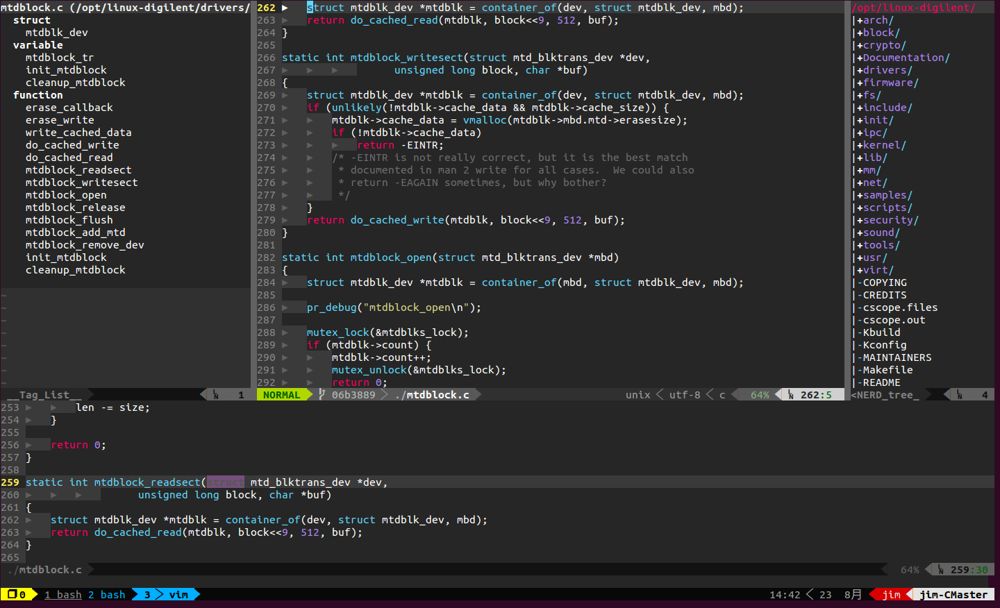

#vim
1. install vundle plugin manager from https://github.com/VundleVim/Vundle.vim.git and copy it to ~/.vim/bundle/ directory
1. overwrite ~/.vimrc with .vimrc
1. open vim and input PluginInstall in command mode
1. after installation success, enjoy you vim journey :-P

# vim-tmux
1. append misc setting to your bashrc
	```
	if [ -d ~/bin ]; then
		export PATH=$PATH:~/bin
	fi

	# fix $TERM for gnome-terminal outside of tmux
	if [ -z $TMUX ]&&[ "$COLORTERM" == "gnome-terminal" ]; then
		export TERM=xterm-256color
	fi

	export EDITOR=vim
	```
1. download tmux theme from https://github.com/gpakosz/.tmux and checkout into the branch identical to your tmux 1ersion
1. you need to upgrade your tmux (use 3rd party ppa) in Ubuntu 14.04 as it is v1.8 and too old to support the gpakosz's theme
	```
	cd ~/tools
	cp vim-tmux/tmux_local_install.sh ./
	./tmux_local_install.sh
	```
1. install the theme as the gpakosz's manual
	```
	cd .tmux
	ln -s `pwd`/.tmux.conf ~/.tmux.conf
	cp .tmux.conf.local ~
	```
1. ensure the $TERM env is set to "screen-256color"
1. enjoy your day :-)

#tips:
1. you may add "setw -g mode-keys vi" to the config to fix the copy-mode key 'v' problem
1. nerdtree source may not work correctly, so use the one within trinity instead

#reference:
1. http://www.jianshu.com/p/d22b63ba0849
1. http://cenalulu.github.io/linux/tmux/
1. http://jay75328.blogspot.tw/2015/05/vim-source-insight.html
1. http://cscope.sourceforge.net/cscope_vim_tutorial.html
