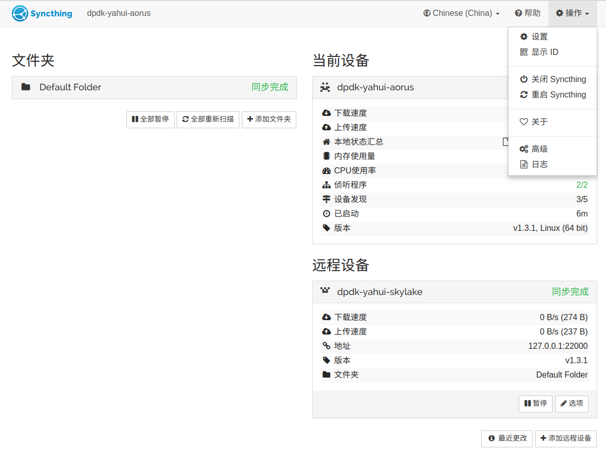
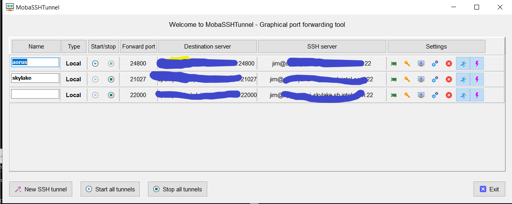

# http proxy

append proxy setting to your bashrc/zshrc

```shell
export http_proxy=http://{URL}:{PORT}
export https_proxy=http://{URL}:{PORT}
```

# vim

1. for vim with system clip board support, you need to install vim-gnome package in Ubuntu

   ```shell
   sudo apt install vim-gnome
   ```

1. install vundle plugin manager from https://github.com/VundleVim/Vundle.vim.git and copy it to ~/.vim/bundle/ directory

   ```shell
   git clone https://github.com/VundleVim/Vundle.vim.git
   ```

1. overwrite ~/.vimrc with .vimrc

1. open vim and input **:PluginInstall** in command mode

1. Assign default editor in your bashrc/zshrc

   ```she
   export EDITOR=vim
   ```

1. after installation success, enjoy you vim journey :-P

# tmux
1. append misc setting to your bashrc (Optional)
	```
	# fix $TERM for gnome-terminal outside of tmux
	if [ -z $TMUX ]&&[ "$COLORTERM" == "gnome-terminal" ]; then
		export TERM=xterm-256color
	fi
	```

1. download tmux theme from https://github.com/gpakosz/.tmux and checkout into the branch identical to your tmux 1ersion

   ```SHEL
   git clone https://github.com/gpakosz/.tmux
   ```

1. install the theme as the gpakosz's manual
	```
	cd .tmux
	ln -s `pwd`/.tmux.conf ~/.tmux.conf
	cp .tmux.conf.local ~
	```

1. .tmux.conf.local config personalization
	```
	set -g status-keys vi
	set -g mode-keys vi

	set -g history-limit 50000
	```

1. ensure the $TERM env is set to "screen-256color"  (Optional)

1. enjoy your day :-)

# zsh install
1. refer to https://www.cnblogs.com/EasonJim/p/7863099.html to install zsh and oh-my-zsh
1. add zsh-autosuggestions and append config at the end of ~/.zshrc:
	```
	# fix $TERM for gnome-terminal outside of tmux
	if [ -z $TMUX ]&&[ "$COLORTERM" '==' "gnome-terminal" ]; then
		export TERM=xterm-256color
	fi

	export EDITOR=vim

	bindkey '^ ' autosuggest-accept
	# disable software flow ctrl in vim
	stty -ixon

	```
1. add command-not-found oh-my-zsh plugin to enable command prompt like:
	```
	Command 'unidef' not found, did you mean:

	  command 'unifdef' from deb unifdef

	Try: sudo apt install <deb name>
	```

# git ssh config
1. To avoid config user for git ssh protocol, create ~/.ssh/config file and fill host and user info like:
	```
	Host A.com
		hostname A.com
		user XXX
	Host B.intel.com
		hostname B.com
		user XXX
	Host C.com
		hostname C.com
		user XXX
	```

# Syncthing

1. Install

2. Create server/client, sync folder, etc...

3. Setup ssh tunnel to pass the firewall

   ```shell
   ssh -L 21027:{HOSTNAME/IP}:21027 -L 22000:{HOSTNAME/IP}:22000 jim@{HOSTNAME/IP} -X
   ```

4. Whenever you want to sync, just click "操作->重启 Syncthing"
   

# Synergy

1. Install
2. Setup ssh tunnel to pass the firewall. port is **24800**
Mobaxterm setup demo:

# tips:

1. nerdtree source may not work correctly, so use the one within trinity instead

# reference:
1. http://www.jianshu.com/p/d22b63ba0849
1. http://cenalulu.github.io/linux/tmux/
1. http://jay75328.blogspot.tw/2015/05/vim-source-insight.html
1. http://cscope.sourceforge.net/cscope_vim_tutorial.html
